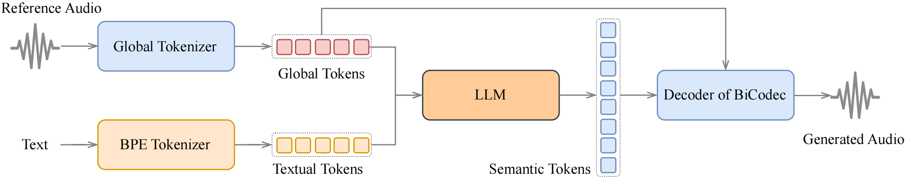

<div align="center">
    <h1>
    Spark-TTS
    </h1>
    <p>
    Official PyTorch code for inference of <br>
    <b><em>Spark-TTS: An Efficient LLM-Based Text-to-Speech Model with Single-Stream Decoupled Speech Tokens</em></b>
    </p>
    <p>
    
    </p>
    <p>
    </p>
    <a href="https://spark-tts.github.io/"></a>
    <a href="https://github.com/SparkAudio/Spark-TTS"></a>
    <a href="https://github.com/SparkAudio/Spark-TTS"></a>
    <a href="https://github.com/SparkAudio/Spark-TTS"></a>
    <a href="https://github.com/SparkAudio/Spark-TTS"></a>
</div>


## Spark-TTS 🔥

### Overview

Spark-TTS is an advanced text-to-speech system that uses the power of large language models (LLM) for highly accurate and natural-sounding voice synthesis. It is designed to be efficient, flexible, and powerful for both research and production use.

### Key Features

- **Simplicity and Efficiency**: Built entirely on Qwen2.5, Spark-TTS eliminates the need for additional generation models like flow matching. Instead of relying on separate models to generate acoustic features, it directly reconstructs audio from the code predicted by the LLM. This approach streamlines the process, improving efficiency and reducing complexity.
- **High-Quality Voice Cloning**: Supports zero-shot voice cloning, which means it can replicate a speaker's voice even without specific training data for that voice. This is ideal for cross-lingual and code-switching scenarios, allowing for seamless transitions between languages and voices without requiring separate training for each one.
- **Bilingual Support**: Supports both Chinese and English, and is capable of zero-shot voice cloning for cross-lingual and code-switching scenarios, enabling the model to synthesize speech in multiple languages with high naturalness and accuracy.
- **Controllable Speech Generation**: Supports creating virtual speakers by adjusting parameters such as gender, pitch, and speaking rate.

---

<table align="center">
  <tr>
    <td align="center"><b>Inference Overview of Voice Cloning</b><br></td>
  </tr>
  <tr>
    <td align="center"><b>Inference Overview of Controlled Generation</b><br></td>
  </tr>
</table>


## To-Do List

- [ ] Release the Spark-TTS paper.
- [ ] Release the training code.
- [ ] Release the training dataset, VoxBox.


## Install
**Clone and Install**

- Clone the repo
``` sh
git clone https://github.com/SparkAudio/Spark-TTS.git
cd Spark-TTS
```

- Install Conda: please see https://docs.conda.io/en/latest/miniconda.html
- Create Conda env:

``` sh
conda create -n sparktts -y python=3.12
conda activate sparktts
pip install -r requirements.txt
# If you are in mainland China, you can set the mirror as follows:
pip install -r requirements.txt -i https://mirrors.aliyun.com/pypi/simple/ --trusted-host=mirrors.aliyun.com
```

**Model Download**

Download via python:
```python
from huggingface_hub import snapshot_download

snapshot_download("SparkAudio/Spark-TTS-0.5B", local_dir="pretrained_models/Spark-TTS-0.5B")
```

Download via git clone:
```sh
mkdir -p pretrained_models

# Make sure you have git-lfs installed (https://git-lfs.com)
git lfs install

git clone https://huggingface.co/SparkAudio/Spark-TTS-0.5B pretrained_models/Spark-TTS-0.5B
```

**Basic Usage**

You can simply run the demo with the following commands:
``` sh
cd example
bash infer.sh
```

Alternatively, you can directly execute the following command in the command line to perform inference：

``` sh
python -m cli.inference \
    --text "text to synthesis." \
    --device 0 \
    --save_dir "path/to/save/audio" \
    --model_dir pretrained_models/Spark-TTS-0.5B \
    --prompt_text "transcript of the prompt audio" \
    --prompt_speech_path "path/to/prompt_audio"
```

**UI Usage**

You can start the UI interface by running `python webui.py`, which allows you to perform Voice Cloning and Voice Creation. Voice Cloning supports uploading reference audio or directly recording the audio.


| **Voice Cloning** | **Voice Creation** |
|:-------------------:|:-------------------:|
|  |  |


## **Demos**

Here are some demos generated by Spark-TTS using zero-shot voice cloning. For more demos, visit our [demo page](https://spark-tts.github.io/).

---

<table>
<tr>
<td align="center">
    
**Donald Trump**
</td>
<td align="center">
    
**Zhongli (Genshin Impact)**
</td>
</tr>

<tr>
<td align="center">

[Donald Trump](https://github.com/user-attachments/assets/fb225780-d9fe-44b2-9b2e-54390cb3d8fd)

</td>
<td align="center">
    
[Zhongli](https://github.com/user-attachments/assets/80eeb9c7-0443-4758-a1ce-55ac59e64bd6)

</td>
</tr>
</table>

---

<table>

<tr>
<td align="center">
    
**陈鲁豫 Chen Luyu**
</td>
<td align="center">
    
**杨澜 Yang Lan**
</td>
</tr>

<tr>
<td align="center">
    
[陈鲁豫Chen_Luyu.webm](https://github.com/user-attachments/assets/5c6585ae-830d-47b1-992d-ee3691f48cf4)
</td>
<td align="center">
    
[Yang_Lan.webm](https://github.com/user-attachments/assets/2fb3d00c-abc3-410e-932f-46ba204fb1d7)
</td>
</tr>
</table>

---


<table>
<tr>
<td align="center">
    
**余承东 Richard Yu**
</td>
<td align="center">
    
**马云 Jack Ma**
</td>
</tr>

<tr>
<td align="center">

[Yu_Chengdong.webm](https://github.com/user-attachments/assets/78feca02-84bb-4d3a-a770-0cfd02f1a8da)

</td>
<td align="center">
    
[Ma_Yun.webm](https://github.com/user-attachments/assets/2d54e2eb-cec4-4c2f-8c84-8fe587da321b)

</td>
</tr>
</table>

---


<table>
<tr>
<td align="center">
    
**刘德华 Andy Lau**
</td>
<td align="center">

**徐志胜 Xu Zhisheng**
</td>
</tr>

<tr>
<td align="center">

[Liu_Dehua.webm](https://github.com/user-attachments/assets/195b5e97-1fee-4955-b954-6d10fa04f1d7)

</td>
<td align="center">
    
[Xu_Zhisheng.webm](https://github.com/user-attachments/assets/dd812af9-76bd-4e26-9988-9cdb9ccbb87b)

</td>
</tr>
</table>


---

<table>
<tr>
<td align="center">
    
**哪吒 Nezha**
</td>
<td align="center">
    
**李靖 Li Jing**
</td>
</tr>

<tr>
<td align="center">

[Ne_Zha.webm](https://github.com/user-attachments/assets/8c608037-a17a-46d4-8588-4db34b49ed1d)
</td>
<td align="center">

[Li_Jing.webm](https://github.com/user-attachments/assets/aa8ba091-097c-4156-b4e3-6445da5ea101)

</td>
</tr>
</table>
